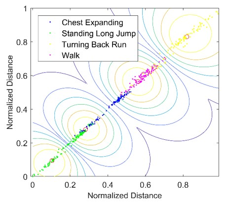
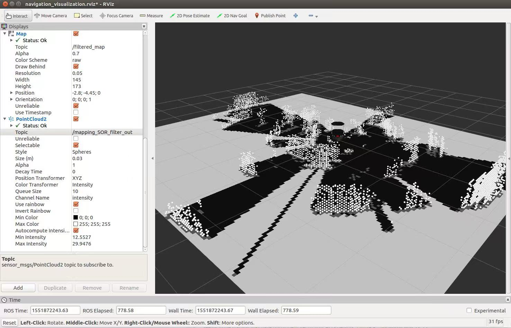
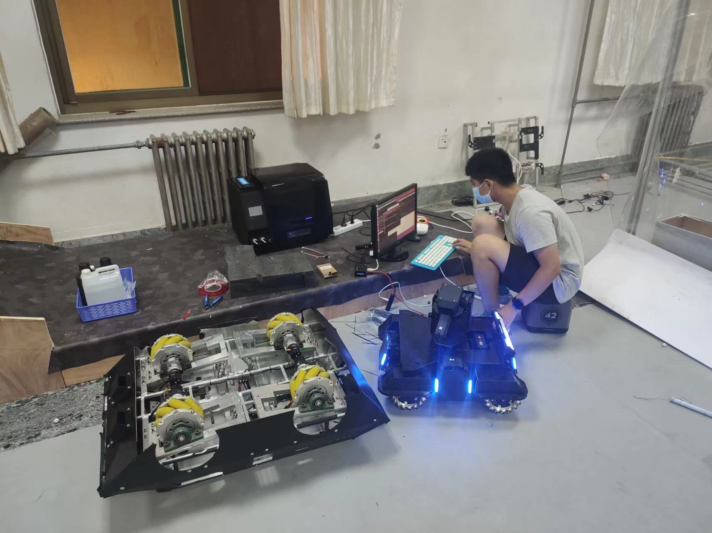

## Hi there! 你好！
I'm Wugang Meng, NICE TO MEET YOU!
I am passionate about Computer Science and the mathematical principles behind it, especially in the areas of *Artificial Intelligence* and *Autonomous Vehicles*.

### Introduction
+ As of Aug. 2021, I am a Master(CS) student in Georgia Institute of Techology.
+ I received the B.Eng(ECE) degree from Harbin Institute of Techology in 2019.
+ Please see my [CV](main.pdf).

### Human Motion Behavior Detector use Radar
Aiming at the human behavior recognition problem of millimeter-wave radar in outdoor road scenes, a multi-angle radar observation scheme and radar selection method are adopted. The ELM model of P-Relu core is established to recognize micro-actions. Experimental results show that the model has a more than 86 percent recognition rate for human behavior in outdoor scenes and a recog-nition accuracy of more than 98 percent for indoor micro-action.

### Radar SLAM
Vision SLAM algorithms are highly complex and require supporting high-performance computing equipment. Multi-line LIDAR itself is expensive and is not suitable for low-cost robot mapping. A low-cost SLAM technique for millimeter-wave radar was given in my undergraduate design and is coupled with a particle filter containing velocity information to solve the under-constrained problem due to sparse radar signals.

